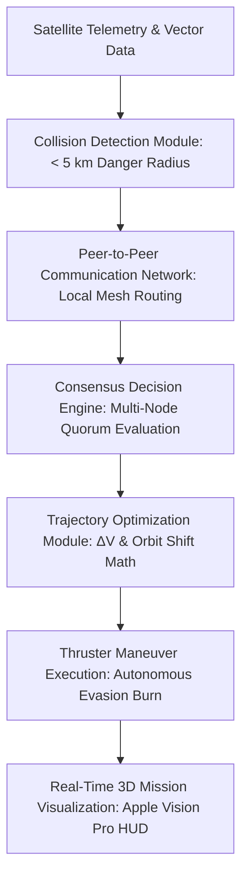

# SwarmOS — Presentation Slides & Project Summary

---

## SLIDE 1 – COVER

# SwarmOS
### The Operating System for Autonomous Space Infrastructure

- **Team:** Radiance  
- **Member:** Srishti Suman Gupta  

---

## SLIDE 2 – PROBLEM STATEMENT & TARGET USERS

### Problem Statement
Develop a **peer-to-peer (P2P) swarm intelligence algorithm** for satellites that enables them to communicate directly, detect potential collisions within a **5 km danger radius**, and autonomously determine which satellite should maneuver and by how much — entirely without relying on a centralized control server.

### Challenges
- 🛑 **Centralized Bottlenecks:** Centralized mission control becomes a bottleneck as satellite constellations grow into the thousands.
- 📡 **Direct P2P Coordination:** Satellites must coordinate using inter-satellite peer-to-peer communication across local neighborhoods.
- ⚡ **Ultra-Low Latency:** Collision avoidance decisions must be made autonomously and in real time without Earth-relay latency.
- ⛽ **Propellant Optimization:** Trajectory adjustments must minimize fuel consumption (`ΔV`) while ensuring global mission continuity and minimal mesh network disruption.

### Expected & Delivered Features
- ✅ **Peer-to-Peer Communication:** Real-time localized packet routing and telemetry broadcasting across neighboring nodes.
- ✅ **Collision Prediction:** Continuous orbital vector monitoring with automated alert triggers upon breaching the 5 km danger radius.
- ✅ **Autonomous Collision Avoidance:** Distributed quorum-based decision making with zero human-in-the-loop dependencies.
- ✅ **Trajectory Adjustment Calculation:** Precision calculation of minimal radial/prograde burn vectors (`ΔV`) and burn durations.
- ✅ **Real-Time Mission Visualization:** Cinematic 3D orbital simulation providing full explainability and situational awareness.

### Target Users
- 🛰️ **Space Agencies:** ISRO, NASA, ESA
- 🌐 **Commercial Satellite Operators:** Starlink, OneWeb, Kuiper
- 🏗️ **Future Orbital Infrastructure Providers:** Space stations, automated cargo depots
- 🔬 **Space Research Organizations & Defense Sectors**

---

## SLIDE 3 – PROPOSED SOLUTION & WORKFLOW

### SwarmOS Platform Overview
**SwarmOS** is a decentralized swarm intelligence platform where satellites function as **autonomous, self-governing agents** instead of passive endpoints waiting for commands from a central ground station.

When two satellites predict a collision within the **5 km danger radius**, they instantly broadcast telemetry packets to nearby neighboring satellites, evaluate each candidate's operational health and mission priority, collaboratively reach a peer-to-peer consensus decision, and automatically execute the safest, minimal-impact maneuver.

### System Workflow

```
[ Collision Prediction (< 5 km Radius) ]
                  ↓
[ Peer-to-Peer Communication Network ]
                  ↓
[ Distributed Consensus Decision Engine ]
                  ↓
[ Trajectory Optimization & ΔV Calculation ]
                  ↓
[ Autonomous Thruster Maneuver Execution ]
                  ↓
[ Mission Restored & Nominal Operations ]
```

### Key Platform Pillars
1. **Decentralized P2P Communication:** Localized neighborhood mesh links (`≤ 3.2 km/units` range) without master nodes.
2. **Distributed Consensus Engine:** Score-based volunteer selection balancing fuel reserves, mission criticality, and burn costs.
3. **Autonomous Maneuver Planning:** Real-time delta-v optimization (`ΔV 0.42 m/s`, `2.1s burn`).
4. **Explainable AI (XAI):** Transparent decision rationale verifying *why* a specific node was chosen over others.
5. **Real-Time 3D Orbital Visualization:** Cinematic Apple Vision Pro + Tesla Mission Control contextual interface.

---

## SLIDE 4 – TECHNICAL APPROACH & ARCHITECTURE

### System Architecture Pipeline



### Technology Stack

#### 🖥️ Frontend & UI Architecture
- **Next.js 15 & TypeScript:** Enterprise-grade, type-safe fullstack web application framework.
- **Tailwind CSS & Vanilla CSS Design System:** Modern, high-contrast, glassmorphic UI design system.
- **Framer Motion:** Fluid micro-animations and contextual overlay transitions (`Contextual Swarm Mission Controller`).

#### 🪐 3D Orbital Simulation & Visualization
- **React Three Fiber (R3F) & Three.js:** High-performance WebGL 3D rendering engine.
- **Drei:** Specialized camera controllers, 3D HTML overlays, and orbital geometry helpers.
- **Dynamic P2P Packets:** Custom shader and frame-loop animations rendering physical data packets along laser links.

#### 🧠 State Management & Swarm Intelligence Engine
- **Zustand:** Ultra-fast, decoupled state orchestrator for real-time simulation loops (`useSwarmStore.ts`).
- **Custom Swarm Engine (`swarmEngine.ts`):** Pure mathematical algorithms implementing:
  - Euclidean distance prediction and time-to-closest-approach matrices.
  - Multi-variable weighted consensus scoring (`Fuel × Priority × Cost`).
  - Kinematic orbital trajectory adjustment calculations (`ΔV`, burn duration, angular separation).

### Key Architectural Innovations
- 🚫 **No Central Controller:** Eliminates single points of failure; the system remains 100% operational even if Earth ground stations go dark.
- 🤖 **Distributed Swarm Intelligence:** True multi-agent collective reasoning across peer nodes.
- 💡 **Explainable Autonomous Decisions:** Every maneuver includes verifiable confidence metrics and physical rationales (`Confidence: 98%`).
- 📈 **Scalable Multi-Agent Architecture:** Designed (`O(N)` local neighborhood checks) to scale effortlessly to mega-constellations.
- 🎬 **Cinematic Mission Control Experience:** High-impact, contextual UI where information only appears when relevant so the interface breathes.

*(Note for Slide Deck: Insert 1-2 high-resolution screenshots of the 3D orbital viewport showing the active P2P communication lines and the contextual Decision Explanation Card.)*

---

## SLIDE 5 – CONCLUSION & FUTURE SCOPE

### Why SwarmOS?
**SwarmOS** demonstrates how decentralized swarm intelligence can enable satellites to safely coordinate and protect each other without relying on a central authority. By moving decision-making directly into orbit, SwarmOS makes future satellite constellations **more scalable, highly resilient, and fully autonomous**.

### Summary of Capabilities
- ✔ **Detects** potential collisions before breach (`< 5 km radius`).
- ✔ **Communicates** directly with neighboring peer satellites (`P2P telemetry`).
- ✔ **Reaches** distributed quorum-based consensus (`Zero master nodes`).
- ✔ **Calculates** the optimal trajectory adjustment (`Minimal ΔV and fuel loss`).
- ✔ **Executes** autonomous collision avoidance burns (`2.1s evasion burn`).
- ✔ **Visualizes** the complete decision process in real time with total transparency (`XAI`).

### Future Scope
- 🛰️ **Mega Satellite Constellations:** Deployment across constellations exceeding 10,000 active nodes in LEO.
- 🌕 **Lunar & Cislunar Communication Networks:** Autonomous traffic management around the Moon where Earth relays face multi-second latency.
- 🌌 **Deep Space & Interplanetary Missions:** Self-governing robotic swarms exploring asteroid belts and outer planets.
- 🛸 **Autonomous Orbital Infrastructure:** Automated space tugs, orbital refueling depots, and active debris removal systems.

### Closing Quote

> *"Today, satellites wait for commands. Tomorrow, they'll protect each other."*

---
### Thank You & Open for Questions!
---

# 📌 PROJECT SUMMARY DOCUMENT

## SwarmOS — Executive Overview
**SwarmOS** is a decentralized swarm intelligence platform that enables satellites to communicate directly with one another, detect potential collisions, collaboratively decide the safest avoidance strategy, and autonomously execute trajectory adjustments without relying on a central control server.

Designed for the future of autonomous space infrastructure, SwarmOS demonstrates how distributed intelligence can make satellite constellations safer, more scalable, and highly resilient through real-time collaboration and transparent visualization.

---

## 🛰️ System Architecture & Workflow Summary
SwarmOS follows a **distributed multi-agent architecture**, where every satellite functions as an independent, self-governing intelligent node:

1. **Continuous Orbital Monitoring & Prediction:** Each satellite continuously calculates its orbital vector and checks distance thresholds against surrounding bodies, flagging intersections that approach the **5 km danger radius**.
2. **Peer-to-Peer Telemetry Exchange:** Upon detecting an anomaly, the involved nodes instantly broadcast local telemetry packets (fuel reserves, mission priority, operational health) to their immediate spatial neighbors over direct inter-satellite laser links (`findNearbySatellites`).
3. **Distributed Consensus Engine:** Neighboring nodes evaluate the candidates using a multi-variable scoring function (`runConsensus`). Satellites carrying critical cargo or suffering guidance loss (e.g., *Hermes Cargo*) are shielded from moving, while high-fuel, survey-priority nodes (e.g., *Gaia Sentinel*) are selected (`Score: 0.94 vs 0.18`).
4. **Trajectory Optimization & Evasion Burn:** The selected node calculates the minimum required delta-v (`ΔV = 0.42 m/s`, `2.1s burn duration`, `+0.18° orbital shift`) to guarantee clearance (`> 15 km separation`) while preserving 99.4% of overall mesh network bandwidth.
5. **Real-Time Contextual Visualization:** Once consensus is reached, the selected satellite fires its thrusters and shifts orbit while the contextual Apple Vision Pro + Tesla Mission Control UI updates dynamically. Upon clearance, all alert overlays and P2P communication lines smoothly fade away, returning the dashboard to a clean, calm state.

This architecture completely eliminates the need for a centralized controller or ground-based master node, enabling truly autonomous, scalable, and resilient coordination among next-generation satellite constellations.
